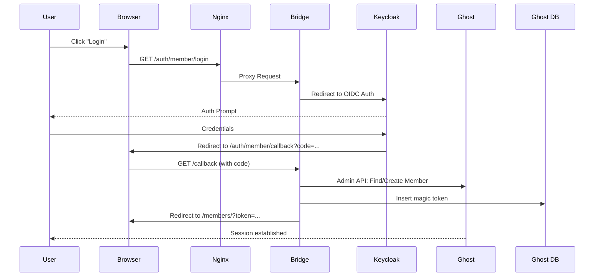
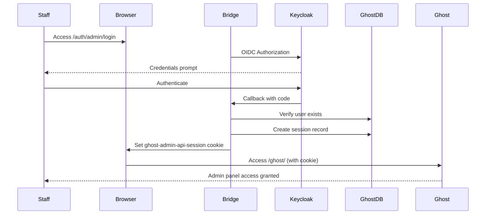

# Ghost Keycloak Bridge

[](https://nodejs.org/)
[](https://www.docker.com/)
[](https://www.keycloak.org/)
[](https://ghost.org/)

[](https://opensource.org/licenses/MIT)
[](./tests/)
[](./tests/)
[](https://github.com/Astocanthus/ghost-keycloak-bridge/issues)

A seamless **SSO (Single Sign-On)** integration between **Keycloak** and self-hosted **Ghost** blogs.

Unlike standard proxies, this bridge creates native Ghost sessions using "Cookie Forgery", allowing users to log in via Keycloak and be recognized as fully authenticated members in Ghost (allowing access to premium content, comments, and newsletters).

---

## Features

- **True SSO Experience**: Users log in via Keycloak and land on Ghost fully authenticated.
- **Dual Realm Support**: Separate Keycloak realms for Members (subscribers) and Staff (admins).
- **Auto-Provisioning**: Automatically creates Ghost members upon first login.
- **Self-Healing Sync**: Uses Keycloak email as the source of truth for user identification.
- **Native Session Support**: Generates valid `ghost-members-ssr` and `ghost-admin-api-session` cookies.
- **Health Check Endpoints**: Kubernetes/Podman ready with `/health`, `/ready`, `/startup` probes.
- **Structured Logging**: Winston-based logging with configurable levels and JSON output.
- **Secure & Rootless**: Docker container runs as non-root user (Node 22 Alpine).
- **Lightweight**: ~50MB Docker image footprint.

---

## Project Structure

```
ghost-keycloak-bridge/
├── Dockerfile                  # Multi-stage build for production
├── package.json
├── jest.config.js              # Jest test configuration
├── LICENSE
├── README.md
├── CHANGELOG.md                # Version history
├── API.md                      # API documentation
├── docs/                       # Additional documentation
├── ghost-sso/                  # Ghost Admin UI injection scripts
│   └── 6.x/                    # Scripts for Ghost 6.x
│       └── custom-start.sh     # Admin UI patcher
├── src/
│   ├── server.js               # Main entry point (Express + OIDC discovery)
│   ├── lib/
│   │   ├── db.js               # MySQL connection pool and query utilities
│   │   ├── logger.js           # Centralized Winston logging
│   │   └── utils.js            # Cryptographic helpers (IDs, tokens, signatures)
│   └── routes/
│       ├── health.js           # Health check endpoints (/health, /ready, /startup)
│       ├── members.js          # Member SSO routes (/auth/member/*)
│       └── staff.js            # Staff SSO routes (/auth/admin/*)
└── tests/                      # Jest test suite
    ├── setup.js                # Test environment configuration
    ├── mocks/
    │   └── logger.mock.js      # Logger mock for unit tests
    └── unit/
        ├── utils.test.js       # Cryptographic utilities tests
        ├── db.test.js          # Database operations tests
        ├── logger.test.js      # Logging module tests
        ├── routes.test.js      # Express routes tests
        └── health.test.js      # Health check tests
```

### Ghost SSO Version Support

The `ghost-sso/` folder contains version-specific scripts for patching the Ghost Admin UI:

| Folder | Ghost Version | Status |
|--------|---------------|--------|
| `6.x/` | Ghost 6.0+ | ✅ Supported |

This structure allows maintaining separate patching logic as Ghost's admin UI evolves between major versions.

---

## Architecture

This bridge works by "spoofing" the Ghost authentication process. Since both services share the same root domain, the bridge can set a secure cookie that Ghost accepts.

### Member Authentication Flow



### Staff Authentication Flow



---

## Quick Start

### Prerequisites

- **Ghost (Self-hosted)**: v5.0+ with MySQL/MariaDB database access.
- **Keycloak**: Two realms configured (Members + Staff) with OIDC clients.
- **Domain**: Ghost and this Bridge must share the same root domain.

### Installation via Docker Compose

Add the bridge service to your existing stack:

```yaml
version: '3.8'

services:
  ghost-bridge:
    image: ghcr.io/astocanthus/ghost-keycloak-bridge:1.1.0
    container_name: ghost-bridge
    restart: always
    environment:
      # Server
      - PORT=3000
      - LOG_LEVEL=info
      - NODE_ENV=production
      - BLOG_PUBLIC_URL=https://blog.example.com
      - GHOST_INTERNAL_URL=http://ghost:2368
      
      # Database (Ghost MySQL)
      - DB_HOST=ghost-db
      - DB_USER=ghost
      - DB_PASSWORD=${GHOST_DB_PASSWORD}
      - DB_NAME=ghost
      
      # Member Realm (Subscribers)
      - MEMBER_KEYCLOAK_ISSUER=https://auth.example.com/realms/members
      - MEMBER_CLIENT_ID=ghost-members
      - MEMBER_CLIENT_SECRET=${MEMBER_CLIENT_SECRET}
      - MEMBER_CALLBACK_URL=https://blog.example.com/auth/member/callback
      
      # Staff Realm (Admins)
      - STAFF_KEYCLOAK_ISSUER=https://auth.example.com/realms/staff
      - STAFF_CLIENT_ID=ghost-admin
      - STAFF_CLIENT_SECRET=${STAFF_CLIENT_SECRET}
      - STAFF_CALLBACK_URL=https://blog.example.com/auth/admin/callback
      
      # Ghost Admin API
      - GHOST_ADMIN_API_KEY=${GHOST_ADMIN_API_KEY}
    depends_on:
      - ghost
      - ghost-db
    networks:
      - ghost-network
    healthcheck:
      test: ["CMD", "wget", "-q", "--spider", "http://localhost:3000/health"]
      interval: 30s
      timeout: 10s
      retries: 3
```

---

## Configuration

### Environment Variables Reference

| Variable | Description | Required | Default |
|----------|-------------|----------|---------|
| `PORT` | Server listen port | No | 3000 |
| `LOG_LEVEL` | Logging verbosity (error, warn, info, http, debug) | No | info (prod) / debug (dev) |
| `NODE_ENV` | Environment mode (production, development) | No | development |
| `BLOG_PUBLIC_URL` | Public URL of your Ghost blog (for browser redirects) | Yes | — |
| `GHOST_INTERNAL_URL` | Internal Docker URL for Ghost API calls | Yes | — |
| `DB_HOST` | Ghost database hostname | Yes | — |
| `DB_USER` | Database username | Yes | — |
| `DB_PASSWORD` | Database password | Yes | — |
| `DB_NAME` | Database name | No | ghost |
| `DB_PORT` | Database port | No | 3306 |
| `MEMBER_KEYCLOAK_ISSUER` | Member realm OIDC issuer URL | Yes | — |
| `MEMBER_CLIENT_ID` | Member realm client ID | Yes | — |
| `MEMBER_CLIENT_SECRET` | Member realm client secret | Yes | — |
| `MEMBER_CALLBACK_URL` | Member callback URL | Yes | — |
| `STAFF_KEYCLOAK_ISSUER` | Staff realm OIDC issuer URL | Yes | — |
| `STAFF_CLIENT_ID` | Staff realm client ID | Yes | — |
| `STAFF_CLIENT_SECRET` | Staff realm client secret | Yes | — |
| `STAFF_CALLBACK_URL` | Staff callback URL | Yes | — |
| `GHOST_ADMIN_API_KEY` | Ghost Admin API integration key | Yes | — |

### Logging Configuration

The bridge uses structured logging with configurable verbosity levels:

| Level | Description | Use Case |
|-------|-------------|----------|
| `error` | Critical failures | Production alerts |
| `warn` | Warning conditions | Degraded functionality |
| `info` | Operational info | Standard production logging |
| `http` | HTTP requests/responses | API debugging |
| `debug` | Detailed diagnostics | Development debugging |

**Production (JSON format):**
```bash
LOG_LEVEL=info NODE_ENV=production node src/server.js
```

**Development (colored output):**
```bash
LOG_LEVEL=debug node src/server.js
```

**Example log output (production):**
```json
{"level":"info","message":"Staff login successful, redirecting to admin","module":"staff","email":"admin@example.com","timestamp":"2026-01-18 10:30:45.123"}
```

**Example log output (development):**
```
10:30:45.123 info [staff] Staff login successful, redirecting to admin {"email":"admin@example.com"}
```

### URL Configuration

The bridge uses two different URLs for Ghost communication:

| Variable | Purpose | Example |
|----------|---------|---------|
| `BLOG_PUBLIC_URL` | Browser redirects, cookie domain | `https://blog.example.com` |
| `GHOST_INTERNAL_URL` | API calls via Docker network | `http://ghost-server:2368` |

This separation is required because:
- Ghost redirects requests when the `Host` header doesn't match its configured URL
- The bridge spoofs the `Host` and `X-Forwarded-Proto` headers to communicate directly with Ghost over the internal Docker network
- External redirects (magic links, logout) must use the public URL

### Nginx Configuration

Map authentication paths to the bridge container:

```nginx
server {
    server_name blog.example.com;

    # Bridge for Member Authentication
    location /auth/member/ {
        proxy_pass http://ghost-bridge:3000/auth/member/;
        proxy_set_header Host $host;
        proxy_set_header X-Real-IP $remote_addr;
        proxy_set_header X-Forwarded-Proto $scheme;
        proxy_set_header X-Forwarded-For $proxy_add_x_forwarded_for;
    }

    # Bridge for Staff Authentication  
    location /auth/admin/ {
        proxy_pass http://ghost-bridge:3000/auth/admin/;
        proxy_set_header Host $host;
        proxy_set_header X-Real-IP $remote_addr;
        proxy_set_header X-Forwarded-Proto $scheme;
        proxy_set_header X-Forwarded-For $proxy_add_x_forwarded_for;
    }

    # Ghost Blog
    location / {
        proxy_pass http://ghost:2368;
        proxy_set_header Host $host;
        proxy_set_header X-Real-IP $remote_addr;
        proxy_set_header X-Forwarded-Proto $scheme;
    }
}
```

---

## Health Check Endpoints

The bridge exposes Kubernetes/Podman-compatible health check endpoints:

| Endpoint | Type | Status Codes | Description |
|----------|------|--------------|-------------|
| `/health` | Liveness | 200 | Process is running |
| `/healthz` | Liveness (alias) | 200 | Same as `/health` |
| `/ready` | Readiness | 200 / 503 | Database connection healthy |
| `/readyz` | Readiness (alias) | 200 / 503 | Same as `/ready` |
| `/startup` | Startup | 200 / 503 | Initialization complete |

### Response Format

```json
{
  "status": "ready",
  "timestamp": "2026-01-19T10:30:45.123Z",
  "checks": {
    "database": true
  }
}
```

### Kubernetes Probe Configuration

```yaml
spec:
  containers:
    - name: ghost-bridge
      image: ghcr.io/astocanthus/ghost-keycloak-bridge:1.1.0
      ports:
        - containerPort: 3000
      livenessProbe:
        httpGet:
          path: /health
          port: 3000
        initialDelaySeconds: 5
        periodSeconds: 10
        timeoutSeconds: 5
        failureThreshold: 3
      readinessProbe:
        httpGet:
          path: /ready
          port: 3000
        initialDelaySeconds: 10
        periodSeconds: 5
        timeoutSeconds: 5
        failureThreshold: 3
      startupProbe:
        httpGet:
          path: /startup
          port: 3000
        failureThreshold: 30
        periodSeconds: 2
```

---

## API Endpoints

### Health Routes (`/`)

| Endpoint | Method | Description |
|----------|--------|-------------|
| `/health` | GET | Liveness probe |
| `/healthz` | GET | Liveness probe (alias) |
| `/ready` | GET | Readiness probe |
| `/readyz` | GET | Readiness probe (alias) |
| `/startup` | GET | Startup probe |

### Member Routes (`/auth/member/`)

| Endpoint | Method | Description |
|----------|--------|-------------|
| `/auth/member/login` | GET | Initiates Keycloak login |
| `/auth/member/login?action=signup` | GET | Redirects to Keycloak registration |
| `/auth/member/logout` | GET | Clears cookies and triggers Keycloak SLO |
| `/auth/member/callback` | GET | OIDC callback handler |
| `/auth/member/debug` | GET | Returns JSON diagnostic info (API connectivity test) |

### Staff Routes (`/auth/admin/`)

| Endpoint | Method | Description |
|----------|--------|-------------|
| `/auth/admin/login` | GET | Initiates staff Keycloak login |
| `/auth/admin/callback` | GET | OIDC callback, creates admin session |

---

## How It Works

### Ghost API Communication

Ghost validates incoming requests against its configured `url` setting. When accessing Ghost from inside a Docker network (e.g., `http://ghost:2368`), Ghost will redirect to its public URL because the `Host` header doesn't match.

The bridge solves this by spoofing HTTP headers:

```
Bridge Request:
  URL: http://ghost-server:2368/ghost/api/admin/members/
  Headers:
    Host: blog.example.com              ← Matches Ghost's configured URL
    X-Forwarded-Proto: https            ← Tells Ghost "this is HTTPS"
    X-Forwarded-Host: blog.example.com  ← Reinforces the hostname
    Authorization: Ghost <JWT>          ← Admin API authentication

Ghost Response:
  200 OK (no redirect!)
  {"members": [...]}
```

### Member Provisioning

When a user logs in via the Member realm:
1. Bridge extracts email from Keycloak ID token
2. Queries Ghost Admin API for existing member
3. Creates member if not found (auto-provisioning)
4. Generates magic link token and inserts into Ghost `tokens` table
5. Redirects user to Ghost's `/members/?token=...` endpoint
6. Ghost validates token and establishes native session

### Staff Session Injection

When a staff user logs in:
1. Bridge validates user exists in Ghost `users` table
2. Retrieves `admin_session_secret` from Ghost settings
3. Creates session record in Ghost `sessions` table
4. Signs session ID using HMAC-SHA256
5. Sets `ghost-admin-api-session` cookie with signature
6. Redirects to `/ghost/` admin panel

### Security Considerations

- **Cookie Scope**: All cookies use `HttpOnly`, `Secure`, and appropriate `SameSite` flags
- **Session Isolation**: Admin cookies scoped to `/ghost` path only
- **Token Validation**: Ghost validates magic tokens and JWT signatures server-side
- **Rootless Container**: Application runs as unprivileged `node` user (UID 1000)
- **API Authentication**: Ghost Admin API calls use short-lived JWTs (5 min expiry)

---

## Development

### Local Setup

```bash
# Clone the repository
git clone https://github.com/Astocanthus/ghost-keycloak-bridge.git
cd ghost-keycloak-bridge

# Install dependencies
npm install

# Run in development mode
npm run dev
```

### Running Tests

The project includes a comprehensive Jest test suite:

```bash
# Run all tests
npm test

# Watch mode (re-run on changes)
npm run test:watch

# Generate coverage report
npm run test:coverage

# CI mode with JUnit reporter
npm run test:ci
```

### Test Coverage

| Module | Statements | Branches | Functions |
|--------|------------|----------|-----------|
| `utils.js` | 100% | 100% | 100% |
| `db.js` | 100% | 69% | 100% |
| `logger.js` | 100% | 91% | 100% |
| `routes/members.js` | 85% | 63% | 100% |
| `routes/staff.js` | 97% | 78% | 100% |
| `routes/health.js` | 100% | 100% | 100% |
| **Total** | **84%** | **70%** | **89%** |

### Building Docker Image

```bash
docker build -t ghost-keycloak-bridge:local .
```

---

## Admin UI Injection (Optional)

The bridge includes an optional script that adds a "Login with OIDC (Staff)" button directly on the Ghost Admin login page.

### How It Works

The `ghost-sso/6.x/custom-start.sh` script:
1. Runs at Ghost container startup (as entrypoint)
2. Locates the Ghost Admin `index.html` file
3. Injects a client-side script that renders the SSO button
4. Launches the Ghost process

### Docker Compose Deployment

Mount the script and override the Ghost entrypoint:

```yaml
services:
  ghost:
    image: ghost:5-alpine
    volumes:
      - ghost-content:/var/lib/ghost/content
      - ./ghost-sso/6.x/custom-start.sh:/var/lib/ghost/custom-start.js:ro
    command: ["node", "/var/lib/ghost/custom-start.js"]
    environment:
      url: https://blog.example.com
      # ... other Ghost config
```

### Kubernetes Deployment

Create a ConfigMap containing the script:

```yaml
apiVersion: v1
kind: ConfigMap
metadata:
  name: ghost-sso-patcher
data:
  custom-start.js: |
    #!/usr/bin/env node
    // ... (paste content from ghost-sso/6.x/custom-start.sh)
---
apiVersion: apps/v1
kind: Deployment
metadata:
  name: ghost
spec:
  template:
    spec:
      containers:
        - name: ghost
          image: ghost:5-alpine
          command: ["node", "/scripts/custom-start.js"]
          volumeMounts:
            - name: sso-script
              mountPath: /scripts
              readOnly: true
      volumes:
        - name: sso-script
          configMap:
            name: ghost-sso-patcher
```

### Result

After deployment, the Ghost Admin login page displays:

```
┌─────────────────────────────────────┐
│         Ghost Admin Login           │
├─────────────────────────────────────┤
│  Email: [________________]          │
│  Password: [________________]       │
│                                     │
│  [ Sign in ]                        │
│  [ Login with OIDC (Staff) ]  ← NEW │
└─────────────────────────────────────┘
```

---

## Troubleshooting

### "Mismatching URL" Error

Ensure Nginx sends `X-Forwarded-Proto $scheme`. The bridge needs to detect HTTPS for OIDC redirect URI validation.

### Ghost API Returns HTML Instead of JSON

This happens when Ghost redirects instead of responding. The bridge handles this by spoofing headers:
- `Host`: matches Ghost's configured URL
- `X-Forwarded-Proto: https`: tells Ghost the connection is secure
- `X-Forwarded-Host`: reinforces the hostname

If you still see this error, verify `GHOST_INTERNAL_URL` points to the correct Docker container and port.

### User Redirected But Not Logged In

Check cookie domain configuration. The `BLOG_PUBLIC_URL` must match the domain where cookies are set.

### Staff Login Returns "user_not_found"

The email from Keycloak must match an existing user in Ghost's `users` table with an active status.

### Admin Session Not Persisting

Verify the `admin_session_secret` exists in Ghost's `settings` table. Fresh Ghost installations may require initial setup.

### Ghost Redirects to Keycloak on API Calls

If using Nginx to protect `/ghost/` with SSO, ensure you exclude the API path:

```nginx
# Ghost Admin API - No auth redirect (JWT protected)
location /ghost/api/ {
    proxy_pass http://127.0.0.1:2368;
    proxy_set_header X-Forwarded-For $proxy_add_x_forwarded_for;
    proxy_set_header X-Forwarded-Proto https;
    proxy_set_header X-Real-IP $remote_addr;
    proxy_set_header Host $http_host;
}

# Ghost Admin Panel - Requires SSO cookie (AFTER /ghost/api/)
location /ghost/ {
    if ($http_cookie !~* "ghost-admin-api-session") {
        return 302 https://$host/auth/admin/login;
    }
    # ... proxy config
}
```

### "invalid_grant (Code not valid)" Error

This is normal user behavior, not a bug. It occurs when:
- User refreshes the callback page (OIDC codes are single-use)
- Code expired (typically 30 seconds lifetime)
- Browser back button after login

### Readiness Probe Failing

Check database connectivity:
```bash
curl http://localhost:3000/ready
```

If `database: false`, verify `DB_HOST`, `DB_USER`, `DB_PASSWORD` environment variables.

---

## License

This project is open source and available under the [MIT License](https://opensource.org/licenses/MIT).

---

## Author

**Benjamin Romeo** - DevOps & Infrastructure Architect

- GitHub: [@Astocanthus](https://github.com/Astocanthus)
- LinkedIn: [Benjamin Romeo](https://www.linkedin.com/in/benjamin-romeo-1a533093/)

---

## Acknowledgments

- Built for [Ghost](https://ghost.org/)
- Built for the [Low-layer Codermug](https://codermug.low-layer.com) Infrastructure
- Powered by [Keycloak](https://www.keycloak.org/) OIDC