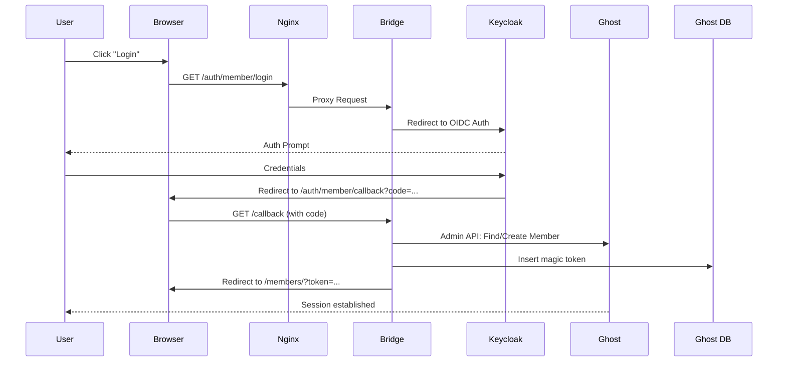
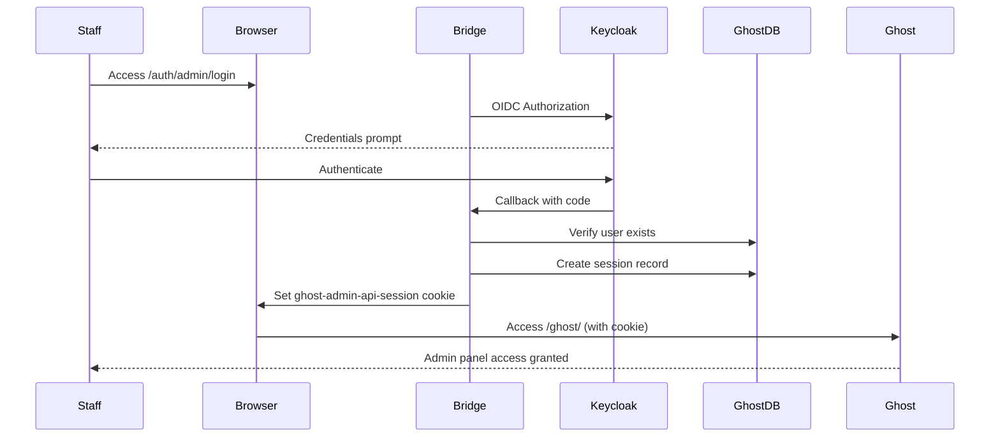

# Ghost Keycloak Bridge

[](https://nodejs.org/)
[](https://www.docker.com/)
[](https://www.keycloak.org/)
[](https://ghost.org/)

[](https://opensource.org/licenses/MIT)
[](https://github.com/Astocanthus/ghost-keycloak-bridge/issues)

A seamless **SSO (Single Sign-On)** integration between **Keycloak** and self-hosted **Ghost** blogs.

Unlike standard proxies, this bridge creates native Ghost sessions using "Cookie Forgery", allowing users to log in via Keycloak and be recognized as fully authenticated members in Ghost (allowing access to premium content, comments, and newsletters).

---

## Features

- **True SSO Experience**: Users log in via Keycloak and land on Ghost fully authenticated.
- **Dual Realm Support**: Separate Keycloak realms for Members (subscribers) and Staff (admins).
- **Auto-Provisioning**: Automatically creates Ghost members upon first login.
- **Self-Healing Sync**: Uses Keycloak email as the source of truth for user identification.
- **Native Session Support**: Generates valid `ghost-members-ssr` and `ghost-admin-api-session` cookies.
- **Secure & Rootless**: Docker container runs as non-root user (Node 22 Alpine).
- **Lightweight**: ~50MB Docker image footprint.

---

## Project Structure

```
ghost-keycloak-bridge/
├── Dockerfile                  # Multi-stage build for production
├── package.json
├── README.md
└── src/
    ├── server.js               # Main entry point (Express + OIDC discovery)
    ├── lib/
    │   ├── db.js               # MySQL connection pool and query utilities
    │   └── utils.js            # Cryptographic helpers (IDs, tokens, signatures)
    └── routes/
        ├── members.js          # Member SSO routes (/auth/member/*)
        └── staff.js            # Staff SSO routes (/auth/admin/*)
```

---

## Architecture

This bridge works by "spoofing" the Ghost authentication process. Since both services share the same root domain, the bridge can set a secure cookie that Ghost accepts.

### Member Authentication Flow



### Staff Authentication Flow



---

## Quick Start

### Prerequisites

- **Ghost (Self-hosted)**: v5.0+ with MySQL/MariaDB database access.
- **Keycloak**: Two realms configured (Members + Staff) with OIDC clients.
- **Domain**: Ghost and this Bridge must share the same root domain.

### Installation via Docker Compose

Add the bridge service to your existing stack:

```yaml
version: '3.8'

services:
  ghost-bridge:
    image: ghcr.io/astocanthus/ghost-keycloak-bridge:latest
    container_name: ghost-bridge
    restart: always
    environment:
      # Server
      - PORT=3000
      - BLOG_PUBLIC_URL=https://blog.example.com
      
      # Database (Ghost MySQL)
      - DB_HOST=ghost-db
      - DB_USER=ghost
      - DB_PASSWORD=${GHOST_DB_PASSWORD}
      - DB_NAME=ghost
      
      # Member Realm (Subscribers)
      - MEMBER_KEYCLOAK_ISSUER=https://auth.example.com/realms/members
      - MEMBER_CLIENT_ID=ghost-members
      - MEMBER_CLIENT_SECRET=${MEMBER_CLIENT_SECRET}
      - MEMBER_CALLBACK_URL=https://blog.example.com/auth/member/callback
      
      # Staff Realm (Admins)
      - STAFF_KEYCLOAK_ISSUER=https://auth.example.com/realms/staff
      - STAFF_CLIENT_ID=ghost-admin
      - STAFF_CLIENT_SECRET=${STAFF_CLIENT_SECRET}
      - STAFF_CALLBACK_URL=https://blog.example.com/auth/admin/callback
      
      # Ghost Admin API
      - GHOST_ADMIN_API_KEY=${GHOST_ADMIN_API_KEY}
    depends_on:
      - ghost
      - ghost-db
    networks:
      - ghost-network
```

---

## Configuration

### Environment Variables Reference

| Variable | Description | Required |
|----------|-------------|----------|
| `PORT` | Server listen port | No (default: 3000) |
| `BLOG_PUBLIC_URL` | Public URL of your Ghost blog | Yes |
| `DB_HOST` | Ghost database hostname | Yes |
| `DB_USER` | Database username | Yes |
| `DB_PASSWORD` | Database password | Yes |
| `DB_NAME` | Database name | No (default: ghost) |
| `DB_PORT` | Database port | No (default: 3306) |
| `MEMBER_KEYCLOAK_ISSUER` | Member realm OIDC issuer URL | Yes |
| `MEMBER_CLIENT_ID` | Member realm client ID | Yes |
| `MEMBER_CLIENT_SECRET` | Member realm client secret | Yes |
| `MEMBER_CALLBACK_URL` | Member callback URL | Yes |
| `STAFF_KEYCLOAK_ISSUER` | Staff realm OIDC issuer URL | Yes |
| `STAFF_CLIENT_ID` | Staff realm client ID | Yes |
| `STAFF_CLIENT_SECRET` | Staff realm client secret | Yes |
| `STAFF_CALLBACK_URL` | Staff callback URL | Yes |
| `GHOST_ADMIN_API_KEY` | Ghost Admin API integration key | Yes |

### Nginx Configuration

Map authentication paths to the bridge container:

```nginx
server {
    server_name blog.example.com;

    # Bridge for Member Authentication
    location /auth/member/ {
        proxy_pass http://ghost-bridge:3000/auth/member/;
        proxy_set_header Host $host;
        proxy_set_header X-Real-IP $remote_addr;
        proxy_set_header X-Forwarded-Proto $scheme;
        proxy_set_header X-Forwarded-For $proxy_add_x_forwarded_for;
    }

    # Bridge for Staff Authentication  
    location /auth/admin/ {
        proxy_pass http://ghost-bridge:3000/auth/admin/;
        proxy_set_header Host $host;
        proxy_set_header X-Real-IP $remote_addr;
        proxy_set_header X-Forwarded-Proto $scheme;
        proxy_set_header X-Forwarded-For $proxy_add_x_forwarded_for;
    }

    # Ghost Blog
    location / {
        proxy_pass http://ghost:2368;
        proxy_set_header Host $host;
        proxy_set_header X-Real-IP $remote_addr;
        proxy_set_header X-Forwarded-Proto $scheme;
    }
}
```

---

## API Endpoints

### Member Routes (`/auth/member/`)

| Endpoint | Method | Description |
|----------|--------|-------------|
| `/auth/member/login` | GET | Initiates Keycloak login |
| `/auth/member/login?action=signup` | GET | Redirects to Keycloak registration |
| `/auth/member/logout` | GET | Clears cookies and triggers Keycloak SLO |
| `/auth/member/callback` | GET | OIDC callback handler |

### Staff Routes (`/auth/admin/`)

| Endpoint | Method | Description |
|----------|--------|-------------|
| `/auth/admin/login` | GET | Initiates staff Keycloak login |
| `/auth/admin/callback` | GET | OIDC callback, creates admin session |

---

## How It Works

### Member Provisioning

When a user logs in via the Member realm:
1. Bridge extracts email from Keycloak ID token
2. Queries Ghost Admin API for existing member
3. Creates member if not found (auto-provisioning)
4. Generates magic link token and inserts into Ghost `tokens` table
5. Redirects user to Ghost's `/members/?token=...` endpoint
6. Ghost validates token and establishes native session

### Staff Session Injection

When a staff user logs in:
1. Bridge validates user exists in Ghost `users` table
2. Retrieves `admin_session_secret` from Ghost settings
3. Creates session record in Ghost `sessions` table
4. Signs session ID using HMAC-SHA256
5. Sets `ghost-admin-api-session` cookie with signature
6. Redirects to `/ghost/` admin panel

### Security Considerations

- **Cookie Scope**: All cookies use `HttpOnly`, `Secure`, and appropriate `SameSite` flags
- **Session Isolation**: Admin cookies scoped to `/ghost` path only
- **Token Validation**: Ghost validates magic tokens and JWT signatures server-side
- **Rootless Container**: Application runs as unprivileged `node` user (UID 1000)

---

## Development

### Local Setup

```bash
# Clone the repository
git clone https://github.com/Astocanthus/ghost-keycloak-bridge.git
cd ghost-keycloak-bridge

# Install dependencies
npm install

# Create .env file
cp .env.example .env
# Edit .env with your configuration

# Run in development mode
npm run dev
```

### Building Docker Image

```bash
docker build -t ghost-keycloak-bridge:local .
```

---

## Troubleshooting

### "Mismatching URL" Error

Ensure Nginx sends `X-Forwarded-Proto $scheme`. The bridge needs to detect HTTPS for OIDC redirect URI validation.

### User Redirected But Not Logged In

Check cookie domain configuration. The `BLOG_PUBLIC_URL` must match the domain where cookies are set.

### Staff Login Returns "user_not_found"

The email from Keycloak must match an existing user in Ghost's `users` table with an active status.

### Admin Session Not Persisting

Verify the `admin_session_secret` exists in Ghost's `settings` table. Fresh Ghost installations may require initial setup.

---

## License

This project is open source and available under the [MIT License](https://opensource.org/licenses/MIT).

---

## Author

**Benjamin Romeo** - DevOps & Infrastructure Architect

- GitHub: [@Astocanthus](https://github.com/Astocanthus)
- LinkedIn: [Benjamin Romeo](https://www.linkedin.com/in/benjamin-romeo-1a533093/)

---

## Acknowledgments

- Built for [Ghost](https://ghost.org/)
- Built for the [Low-layer Codermug](https://codermug.low-layer.com) Infrastructure
- Powered by [Keycloak](https://www.keycloak.org/) OIDC